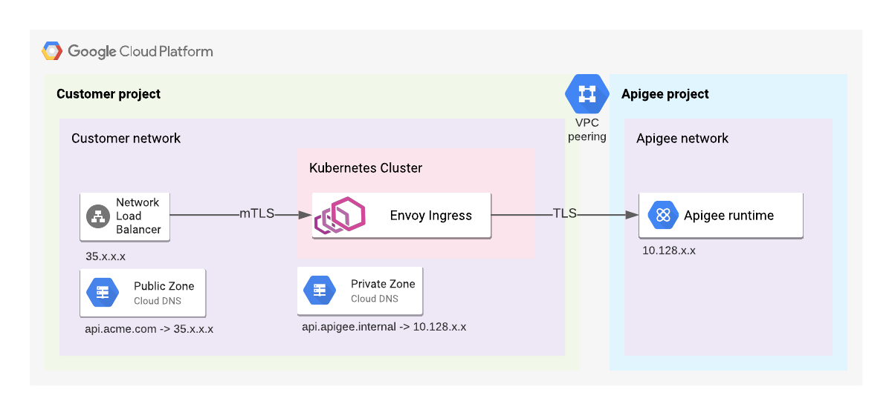

# Enabling mTLS with Apigee X

Use case: Enable mTLS between external clients and the Apigee instance

At the moment, Google Cloud Load Balancers do not support mTLS. As a workaround this solution proposes the use of Anthos Service Mesh. See this diagram for the flow of traffic



## Installation

Setup:

1. Review the variables.tf files
2. Set `gcloud` to the project `gcloud config set project $PROJECT`

Step 1. Cluster setup
This step provisions

* A Cloud KMS Key and Key Ring (for application-layer encryption of secrets)
  * NOTE: Change the terraform script to use an existing key
* An external regional IP (for L4 Load Balancer)
* A Cloud DNS Private Zone
* A DNS A record to map Apigee' Instance IP to to a DNS name
* A GKE cluster

```sh
cd cluster-setup
terraform init
terraform apply
```

Step 2. ASM Installation
This step provisions

* ASM 1.8.x (default installation)
* Creates a `Gateway` with the template [here](./asm-install/gateway.tpl)
* Creates a `VirtualService` with the template [here](./asm-install/virtualservice.tpl)
* Creates a `DestinationRule` with the template [here](./asm-install/destinationrules.tpl)
* Creates a `ServiceEntry` with the template [here](./asm-install/serviceentry.tpl)

```sh
cd asm-install
terraform init
terraform apply
```

NOTE: The Kubernetes Secrets (for certificates) are not part of this script. They are created out-of-band. 